# Tutorial and Help System Features

## Overview

TrekSuper now includes a comprehensive tutorial system with interactive guidance, beginner mode hints, and enhanced help documentation with Mermaid diagrams.

## Features Implemented

### 1. Interactive Tutorial Command ✅

**Usage:** `TUTORIAL` or `TUT`

The interactive tutorial guides new players through the essential commands step-by-step.

**Tutorial Steps:**
1. **Welcome** - Introduction to the game
2. **STATUS** - Check ship status
3. **SRSCAN** - Short-range scan
4. **LRSCAN** - Long-range scan
5. **SHIELDS UP** - Raise shields
6. **IMPULSE** - Move within sector (learn 0.1 = 1 sector)
7. **CHART** - View galaxy map
8. **HELP** - Get command help

**Features:**
- ✅ Step-by-step progression
- ✅ Validates each command before advancing
- ✅ Clear task instructions for each step
- ✅ Success messages when completed correctly
- ✅ Hints if user gets stuck
- ✅ Progress tracking (Step X/Y)

### 2. Beginner Mode with Contextual Hints ✅

Automatically enabled during tutorial, provides smart hints based on game state.

**Contextual Hints Include:**
- ⚠️ "Enemies detected! Raise shields with 'SHIELDS UP'"
- ⚠️ "Energy is low. Consider transferring shield energy back"
- ⚠️ "Energy critical! Find a starbase and DOCK"
- 💡 "Next: Try 'PHASERS 500' to attack enemies"
- 💡 "Next: Use 'CHART' to see the galaxy map"

**How It Works:**
- Analyzes current game state after each command
- Suggests logical next actions
- Warns about dangerous situations
- Helps prevent common mistakes

### 3. Practice Scenario ✅

The tutorial provides a safe learning environment:
- Controlled starting position
- Manageable enemy count
- Clear objectives
- Forgiving gameplay

**Practice Features:**
- Safe to make mistakes
- No time pressure during tutorial
- Focus on learning, not winning
- Can restart anytime

### 4. Enhanced Help with Mermaid Diagrams ✅

**Command-Specific Help:**
```
HELP IMPULSE    - Detailed IMPULSE documentation
HELP SHIELDS    - Complete SHIELDS guide
HELP <any>      - Help for any command
```

**Mermaid Diagram Features:**

**Navigation Compass** (in `HELP IMPULSE`):

```mermaid
graph TB
    subgraph "Navigation Compass"
        D12["12<br/>⬆️ UP"]
        D3["3<br/>➡️ RIGHT"]
        D6["6<br/>⬇️ DOWN"]
        D9["9<br/>⬅️ LEFT"]
        E["🚀<br/>ENTERPRISE"]
    end
```


Shows all 12 directions with visual arrows and positioning.

**Help Documentation Includes:**
- Complete usage syntax
- Parameter explanations
- Practical examples (0.1 sectors, 0.5 sectors, etc.)
- Energy cost calculations
- Safety warnings
- Tactical tips
- Related commands

## Tutorial System Architecture

### TutorialService

**Location:** `src/TrekSuper.Core/Services/TutorialService.cs`

**Responsibilities:**
- Manages tutorial progression
- Tracks current step
- Validates command execution
- Provides contextual hints
- Controls beginner mode

**Key Methods:**
```csharp
StartTutorial()                          // Begin tutorial
EndTutorial()                            // Complete tutorial
OnCommandExecuted(command, success)      // Track progress
GetContextualHint(command, state)        // Smart hints
ShowCurrentStep()                        // Display current task
```

### TutorialCommand

**Location:** `src/TrekSuper.Core/Commands/TutorialCommand.cs`

**Usage:** `TUTORIAL` or `TUT`

Starts the interactive tutorial and enables beginner mode.

### Integration

**GameEngine Integration:**
- `Tutorial` service added to GameEngine
- Initialized automatically with game
- Available throughout gameplay

**GameStateManager Integration:**
- Notifies tutorial on command execution
- Displays beginner hints after commands
- Tracks tutorial progress across game session

## Usage Examples

### Starting Tutorial
```
> TUTORIAL

🎓 Starting Interactive Tutorial...
This tutorial will teach you the basics of Super Star Trek.
Follow the instructions for each step.

============================================================
📚 TUTORIAL STEP 1/8: Welcome to Star Trek
============================================================
Welcome, Captain! You are in command of the USS Enterprise.
Your mission: Destroy all Klingon ships before time runs out.

▶️  YOUR TASK: Type STATUS to see your ship's current status
💡 Hint: Type: STATUS (or just ST)
```

### Getting Detailed Help
```
> HELP IMPULSE

*** IMPULSE (IM) ***

Move using impulse engines. Usage: IM <direction> <distance>

USAGE:
  IMPULSE <direction> <distance>
  IM <direction> <distance>

DESCRIPTION:
  Move the Enterprise using impulse engines for short-range movement

PARAMETERS:
  <direction>  - Direction to move (1-12, like a clock face)
  <distance>   - Distance in QUADRANTS (1 quadrant = 10 sectors)
                 0.1 = 1 sector   (precise movement)
                 0.5 = 5 sectors  (medium range)
                 1.0 = 10 sectors (maximum impulse range)

[Mermaid Navigation Compass Diagram]

EXAMPLES:
  IM 6 0.1     - Move 1 sector straight down
  IM 3 0.2     - Move 2 sectors to the right

[... full documentation ...]
```

### Beginner Mode Hints
```
> SRSCAN
[Sector scan shows enemies]

💡 Tip: Enemies detected! Raise shields with 'SHIELDS UP' before they attack.

> SHIELDS UP
✅ Shields raised!

> IM 3 0.2
[Ship moves, enemies attack]

💡 Next: Try 'PHASERS 500' to attack enemies
```

## Benefits

### For New Players
- ✅ Gentle learning curve
- ✅ Clear step-by-step guidance
- ✅ Prevents common mistakes
- ✅ Builds confidence
- ✅ Learn by doing

### For Experienced Players
- ✅ Quick reference with `HELP <command>`
- ✅ Visual diagrams for complex systems
- ✅ Can disable beginner mode
- ✅ Comprehensive documentation

### For Development
- ✅ Modular tutorial system
- ✅ Easy to add new steps
- ✅ Extensible hint system
- ✅ Integrated with game engine

## Technical Details

### Tutorial Steps Structure
```csharp
public class TutorialStep
{
    public string Title { get; init; }
    public string Description { get; init; }
    public string Task { get; init; }
    public List<string> ExpectedCommands { get; init; }
    public string SuccessMessage { get; init; }
    public string Hint { get; init; }
}
```

### Hint System
Context-aware hints analyze:
- Current energy levels
- Shield status
- Enemy presence
- Last command executed
- Mission objectives

### Beginner Mode Toggle
```csharp
Engine.Tutorial.IsBeginnerMode = true/false;
```

Can be toggled on/off at any time during gameplay.

## Future Enhancements

Potential additions:
- [ ] Advanced tutorial for combat tactics
- [ ] Tutorial for warp travel and navigation
- [ ] Starbase operations tutorial
- [ ] Tournament mode introduction
- [ ] Custom tutorial scenarios
- [ ] Tutorial progress saving
- [ ] Multiple difficulty levels
- [ ] Achievement system for tutorial completion

## Testing

**Tested Scenarios:**
- ✅ Tutorial command execution
- ✅ Step progression
- ✅ Hint system activation
- ✅ Beginner mode integration
- ✅ Help system with Mermaid diagrams
- ✅ All 50 existing tests still pass

## Documentation

**Key Files:**
- `TUTORIAL-FEATURES.md` - This file
- `PLAYTESTING.md` - Automated test documentation
- `TEST-RESULTS.md` - Validation results
- `TrekSuper-Architecture.md` - System architecture

## Summary

The tutorial system transforms TrekSuper from a complex game into an accessible experience for new players while maintaining depth for veterans. The combination of interactive guidance, contextual hints, and comprehensive help documentation ensures players can learn at their own pace and reference information when needed.

**Key Achievements:**
- 🎓 Complete interactive tutorial
- 💡 Smart contextual hints
- 📚 Enhanced help with Mermaid diagrams
- 🛡️ Navigation safety system
- ✅ All tests passing (50/50)

**Impact:**
- Dramatically improved new player experience
- Reduced learning curve
- Better in-game documentation
- Safer gameplay (no more accidental ship destruction)
